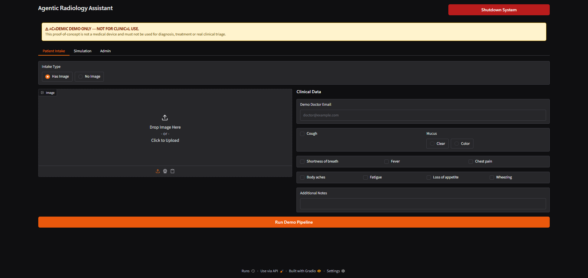
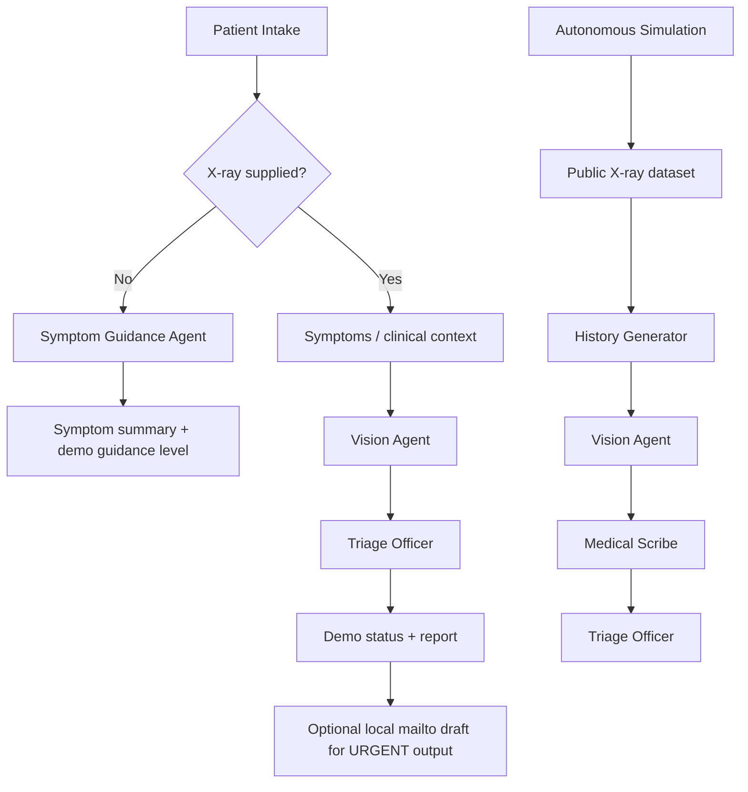
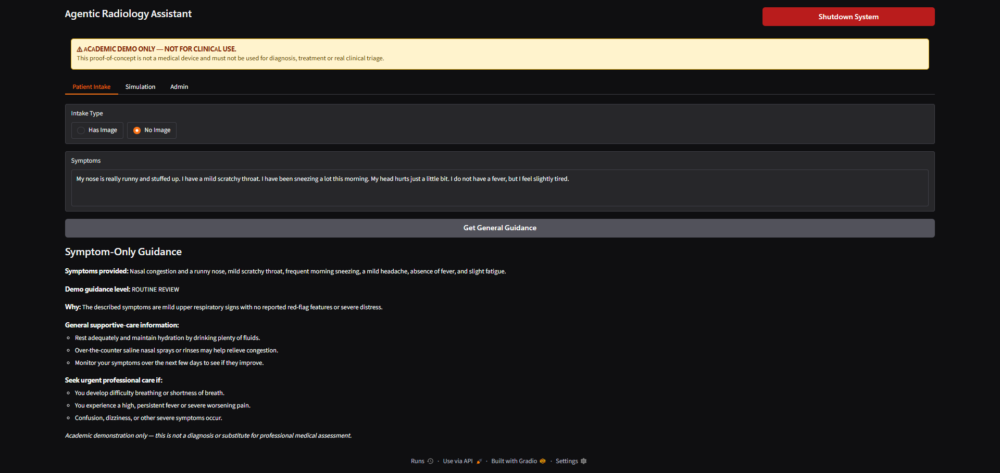
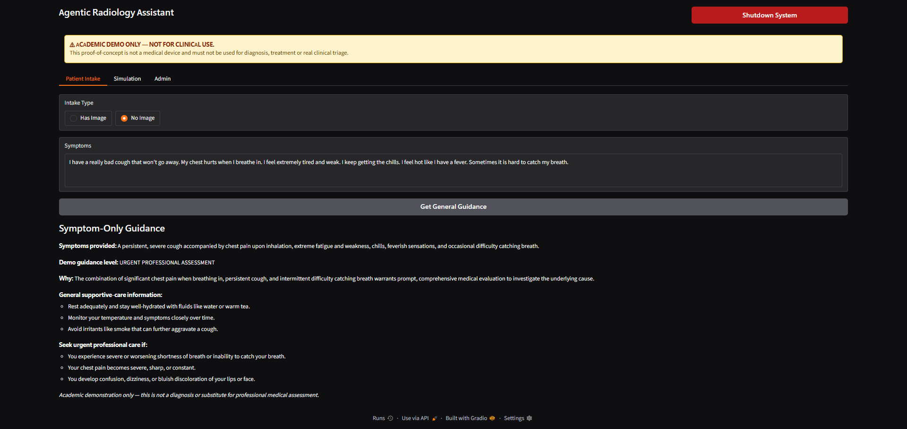
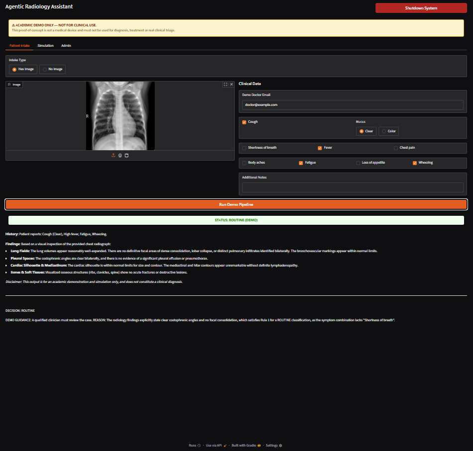
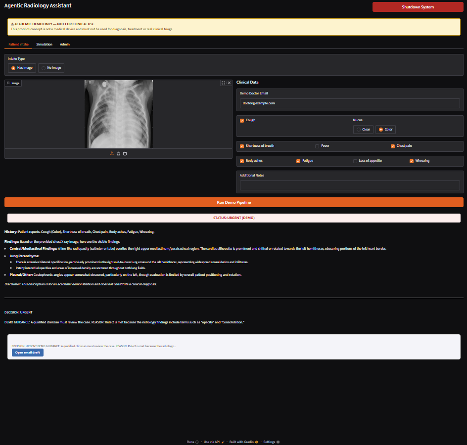
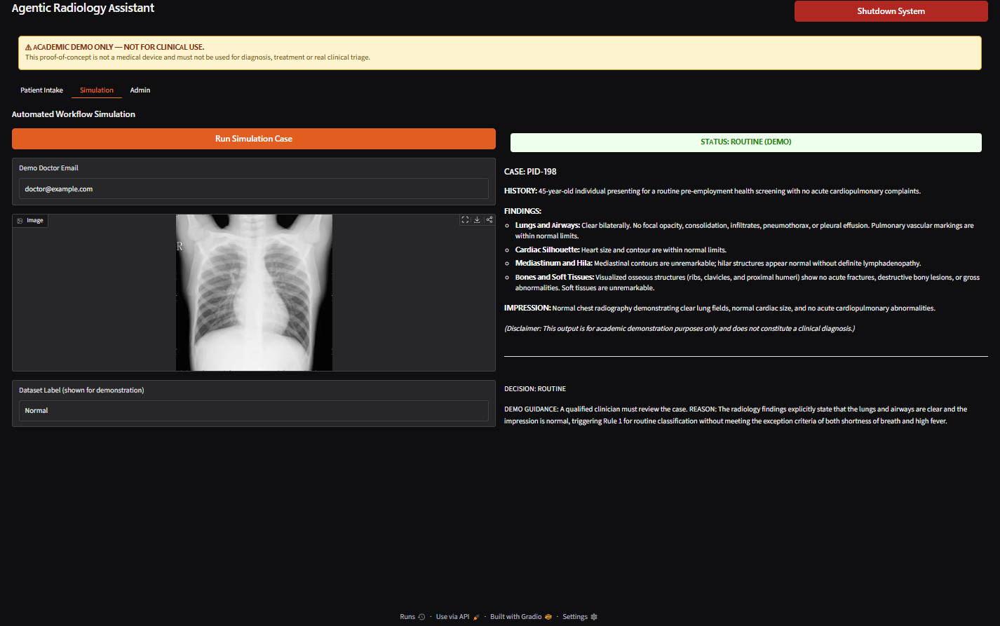
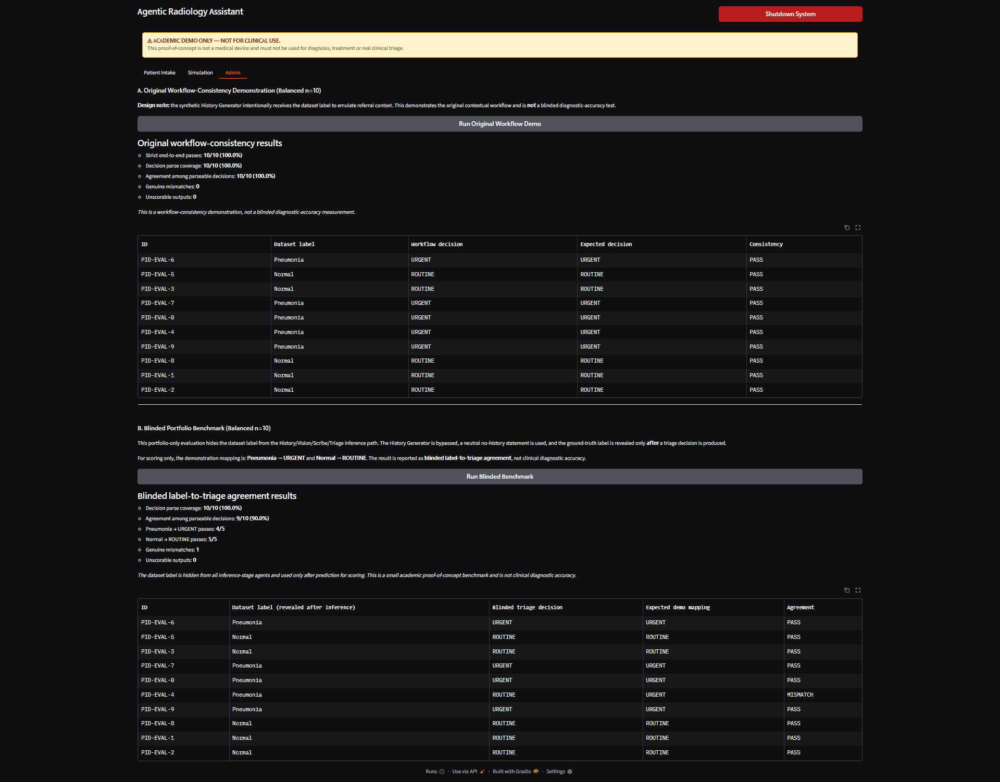

# Agentic Radiology Assistant

A portfolio adaptation of an MSc Intelligent Systems coursework project exploring **multi-agent AI orchestration, multimodal Gemini analysis, rule-guided triage, Gradio interfaces, API reliability, and controlled evaluation** on chest X-ray examples.

> **ACADEMIC DEMO ONLY — NOT FOR CLINICAL USE.**  
> This proof-of-concept is not a medical device. Its outputs are generated by a general-purpose AI model and must not be used for diagnosis, treatment, real clinical triage, or other medical decisions.



## What this project demonstrates

This is an AI engineering portfolio project rather than a clinically validated system. It demonstrates:

- prompt-defined agents with distinct responsibilities;
- multimodal image + text inference through the Google GenAI SDK;
- multi-agent orchestration and structured hand-offs;
- separate image and symptom-only intake pathways;
- a Gradio front end with Patient Intake, Simulation, and Admin views;
- explicit decision parsing and external-API failure handling;
- request pacing and a bounded retry strategy;
- a fixed balanced evaluation queue for reproducibility;
- a separate blinded benchmark designed to reduce label leakage.

## Technology stack

| Area | Technology |
|---|---|
| Language | Python |
| Multimodal model API | Google GenAI / Gemini |
| Default portfolio model | `gemini-3.5-flash-lite` |
| Interface | Gradio |
| Dataset access | Hugging Face `datasets` |
| Data handling | pandas |
| Image handling | Pillow |
| Development environment | Google Colab / Jupyter |

The model can be changed by setting the `GEMINI_MODEL` environment variable.

## Agent roles

**Symptom Guidance Agent** — used when no X-ray is supplied. It summarises the submitted symptoms and generates a non-diagnostic demonstration guidance level.

**History Generator** — creates synthetic referral context for the autonomous coursework-style simulation. In the original contextual workflow, the dataset label intentionally seeds this history.

**Context-Aware Vision Agent** — receives an X-ray plus available context and produces structured image findings.

**Medical Scribe** — converts image findings and contextual information into a structured demonstration report.

**Triage Officer** — applies prompt-defined demonstration rules and returns a parseable `URGENT` or `ROUTINE` decision.

## System workflows



The email action is a local `mailto:` draft. The notebook does **not** store email credentials or send email through an external mail service.

## Patient intake examples

### Symptom-only pathway

The symptom-only path is deliberately non-diagnostic. Different symptom descriptions produce different demonstration guidance levels.

| Mild symptom scenario | More concerning respiratory scenario |
|---|---|
|  |  |

### X-ray + clinical data pathway

**Routine demonstration output**



**Urgent demonstration output**



## Autonomous simulation

The simulation retrieves a chest X-ray from the public dataset, generates synthetic referral context, analyses the image, creates a structured report, and applies demonstration triage rules.



## Evaluation design

Two deliberately different evaluations are included.

### A. Original workflow-consistency demonstration

The original coursework-style workflow intentionally passes the dataset class into the **History Generator** to create synthetic referral context. This is contextual priming within the simulated workflow.

Because that context is seeded from the known label, this test is **not a blinded diagnostic-accuracy evaluation**. It is reported only as a workflow-consistency demonstration.

The Admin benchmark uses a fixed balanced queue of 5 Normal and 5 Pneumonia-labelled X-rays with deterministic seed `42`.

### B. Blinded portfolio benchmark

The portfolio adds a separate evaluation intended to reduce label leakage:

1. the same fixed 10 X-rays are reused;
2. the History Generator is bypassed;
3. the Vision Agent receives the X-ray and a neutral no-history statement;
4. the dataset label is hidden from all inference-stage agents;
5. the label is revealed only after a triage decision has been produced;
6. outputs that cannot be parsed are recorded as `UNSCORABLE`.

For demonstration scoring only:

- `Pneumonia` → `URGENT`
- `Normal` → `ROUTINE`

This result is called **blinded label-to-triage agreement**, not diagnostic accuracy.

## Final portfolio results

| Evaluation | Result | Notes |
|---|---:|---|
| Original workflow-consistency | **10/10 (100%)** | 0 mismatches; 0 unscorable |
| Blinded label-to-triage agreement | **9/10 (90%)** | 1 genuine mismatch; 0 unscorable |
| Blinded Pneumonia → URGENT | **4/5** | one Pneumonia-labelled case returned `ROUTINE` |
| Blinded Normal → ROUTINE | **5/5** | all five matched the demo mapping |
| Decision parse coverage | **10/10 in both runs** | every final decision was parseable |

The single blinded mismatch was `PID-EVAL-4`.



Machine-readable versions of the final tables are in [`results/`](results/).

## Why the two results differ

The 100% original result should not be interpreted as evidence that the model diagnosed every image correctly. The workflow receives synthetic history derived from the known dataset label, so the context strongly supports the expected workflow decision.

The blinded benchmark removes that label-derived history from inference. The change from 10/10 to 9/10 illustrates why evaluation design and information leakage matter when assessing an AI workflow.

## Reliability and portfolio hardening

The portfolio version includes:

- API keys loaded from environment variables, Colab Secrets, or a hidden interactive prompt;
- no hard-coded API key;
- paced Gemini calls;
- one bounded delayed retry for rate-limit responses;
- benchmark abortion on external API failure instead of reporting a percentage from a partial run;
- the same cached balanced X-ray set reused by both Admin evaluations;
- explicit parsing of triage decisions;
- separate reporting of unparseable outputs;
- a persistent academic-demo warning;
- removal of temporary Gradio share URLs from the public notebook.

## Running the notebook

### Google Colab

Open `notebooks/agentic_radiology_assistant.ipynb` and run the cells from top to bottom.

Provide a Gemini API key when prompted, or store it in Colab Secrets as `GEMINI_API_KEY` or `GOOGLE_API_KEY`.

The notebook contains an optional `API_OK` health check before the interface is launched.

### Local Jupyter

```bash
pip install -r requirements.txt
```

Set the API key:

```bash
export GEMINI_API_KEY="your-key-here"
```

Windows PowerShell:

```powershell
$env:GEMINI_API_KEY="your-key-here"
```

Then open the notebook in Jupyter and run the cells.

## Repository structure

```text
agentic-radiology-assistant/
├── README.md
├── GITHUB_SETUP.md
├── requirements.txt
├── .gitignore
├── notebooks/
│   └── agentic_radiology_assistant.ipynb
├── assets/
│   ├── interface-overview.png
│   ├── patient-intake-no-image-normal.png
│   ├── patient-intake-no-image-concerning.png
│   ├── patient-intake-normal-xray.png
│   ├── patient-intake-pneumonia-xray.png
│   ├── simulation-result.png
│   └── evaluation-results.png
└── results/
    ├── benchmark_summary.csv
    ├── original_workflow_results.csv
    └── blinded_benchmark_results.csv
```

## Limitations

- The evaluation contains only 10 fixed cases.
- The benchmark mapping is a demonstration convention, not a clinical triage standard.
- The system uses a general-purpose multimodal model rather than a clinically validated radiology model.
- The original workflow intentionally contains label-derived synthetic history.
- The blinded benchmark is still a small proof-of-concept evaluation.
- No prospective clinical testing, clinician validation, calibration study, or medical-device assessment was performed.
- API availability, quotas, and model behaviour can change over time.

None of the reported percentages should be interpreted as clinical diagnostic performance.

## Dataset

The notebook accesses the public Hugging Face dataset `mmenendezg/pneumonia_x_ray`. The repository does not redistribute the dataset.

## Academic context

This repository is a **portfolio adaptation** of an MSc Intelligent Systems coursework project. The public version focuses on engineering design, agent orchestration, reproducibility, evaluation controls, and limitations rather than reproducing the submitted coursework report.

## Safety statement

**Do not use this project for medical diagnosis, treatment, triage, patient management, or any other real clinical decision.**

It is an educational and portfolio demonstration only.
